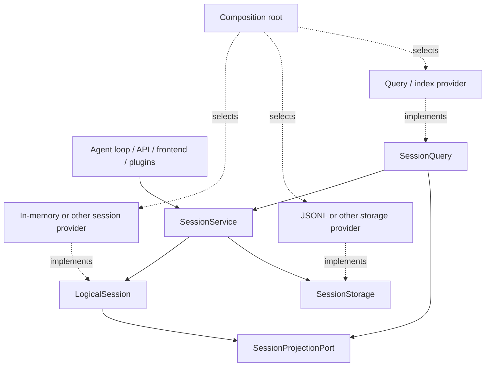

# Agent Note: Session capability protocols

Status: proposed

English | [中文](2026-09-10-session-capability-protocols.zh.md)

## Problem

Keeping the legacy `Session` compatibility name does not make implementations replaceable. If storage, query, projection, or frontend code assumes that concrete in-memory class, JSONL paths, or a concrete index schema, physical implementation still leaks across the system.

## Proposal

Treat the session system as a small logical core with orthogonal capabilities. Ordinary product code knows only `LogicalSession` + `SessionService`; provider authors implement physical protocols separately. The signatures below are targets and are not all implemented in Stage 3.

### Developer convention during migration

- Existing external integrations may temporarily keep the deprecated `Session`, `Session.create`, and `Session.fromRestore` compatibility API.
- Repository production code and all new integrations type sessions as `LogicalSession` and acquire live sessions from `SessionService` (`ctx.sessions`). Do not add a new `Session` import merely because compatibility exists.
- Use `createLogicalSession` or `restoreLogicalSession` only for genuinely detached construction, validation, provider adapters, and focused tests. Product features must not use detached factories to bypass service lifecycle.
- Read events, headers, surface projections, ids, and derived messages from the `LogicalSession` members. Use `SessionQuery` for cold, indexed, filtered, search, list, or statistics reads. Do not read provider files or indexes directly.
- Projection derives rebuildable read models from canonical events. It neither replaces the logical session nor becomes durable recovery authority.
- Only composition and provider packages may know a physical session, storage, query, or projection implementation. A dependency gate enforces the concrete `Session` part of this rule inside repository production sources.

### `LogicalSession`

A logical session is an identified event session, independent of where its events are stored and whether they are published. It owns header, fork boundary, sequence, surface, append, and snapshot semantics. Callers do not know whether events live in an array, shared memory, a database, or a remote process. Implementations preserve immutable snapshots, contiguous sequences, object identity, event validation, and explicit close behavior.

### `SessionService`

```ts ignore-check
abstract class SessionService extends Service {
  abstract create(options?: CreateSessionOptions): Promise<LogicalSession>
  abstract open(id: SessionId, options: SessionOpenOptions): Promise<LogicalSession>
  abstract enter(session: LogicalSession): () => void
  abstract announce(session: LogicalSession): void
  abstract get(id: SessionId): LogicalSession | undefined
  abstract list(): readonly LogicalSession[]
  abstract fork(source: LogicalSession | SessionId, boundary?: SessionSeq, childId?: SessionId): Promise<LogicalSession>
  abstract flush(session: LogicalSession): Promise<boolean>
  abstract registerProjectionPort(port: SessionProjectionPort): () => void
}
```

The service is the only live session acquisition point and live identity authority. `create`, `open`, and `fork` finish fallible preparation before publication. `enter` returns a synchronous disposer. `announce` publishes only an entered session. `flush` combines owned participants. Projection registration is removable and also applies to unpublished sessions.

### `SessionStorage`

The physical persistence protocol only creates/opens readers, opens writers, stats/lists records, and defines reader/writer read, append, flush, and close. A provider owns durable revisions, format generations, migration, leases, compression, and paths. JSONL is one implementation. Ordinary code does not treat a storage handle as a session or assemble persistence from lifecycle events.

### `SessionProjectionPort`

Projection consumes canonical session events and headers to produce titles, summaries, statistics, list metadata, search documents, or other read models. It is not a second Session and does not own writes. Every projection can rebuild from the durable log. The service registers projection ports so live sessions and cold readers share semantics, and flush/close waits for admitted work.

### `SessionQuery`

The repository already plans and implements `SessionQuery` for live-preferred retrieval. This proposal keeps it as the unified read abstraction and extends its scope to exact event reads, filters, traces, full-text retrieval, list metadata, and statistics reads. No separate `SessionSearch` or `SessionStats` is planned. Concrete indexes and statistics aggregations are replaceable, rebuildable projections/providers. Query obtains logical data through `SessionService`, logical sessions, and canonical storage readers; it does not import the in-memory implementation or JSONL.

### Overall architecture



### Dependency rule

Frontend, headers, loading, persistence, migration, search, statistics, and telemetry may depend on the logical core or their own capability interfaces. Only composition sees both abstractions and concrete providers. Each provider package is cohesive and passes a shared contract suite. Reverse imports and provider-name branches are forbidden.

## Alternatives considered

**Let every feature read storage directly.** Rejected because durable rows are not logical sessions and would turn migration and provider schema into product contracts.

**Create separate services for search and statistics.** Rejected because existing `SessionQuery` already owns unified read semantics. More services would split the entry point.

## Acceptance criteria

- A second session/service or storage provider passes the same contract suite without ordinary-consumer changes.
- Query indexes and statistics projections can rebuild or be replaced without changing the Session durable source of truth.
- A dependency gate permits concrete implementation imports only in composition and provider tests.

## Risks

`SessionService` publication, storage, and projection timing does not reach the target signature in Stage 3. Implementation belongs to later stages; this note must not present unshipped behavior as current. A remote session implementation may also expose real limits in synchronous `append` and lifecycle substitution, and evidence should then revise the protocol.
