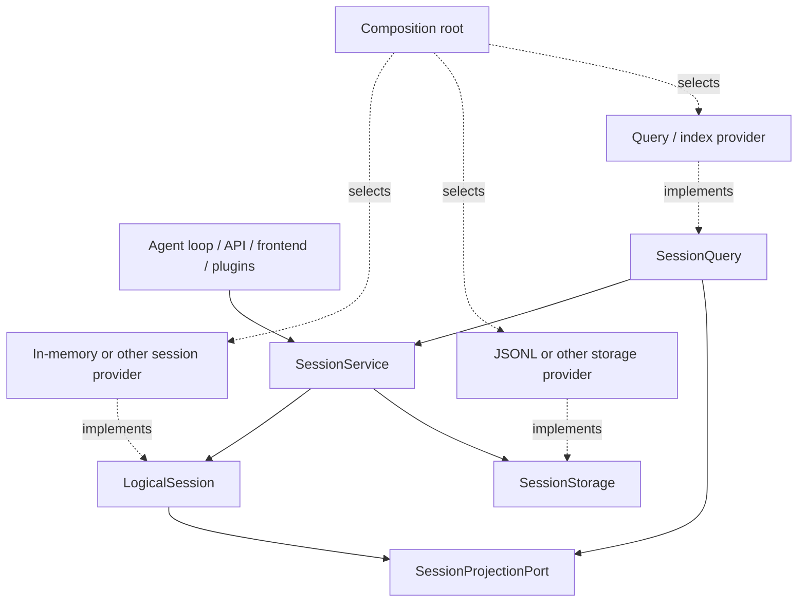

# Agent Note: Session 能力协议

Status: proposed

[English](2026-09-10-session-capability-protocols.md) | 中文

## Problem

保留旧 `Session` 兼容名称并不等于实现已经可替换。若 storage、query、projection 或前端继续假设这个具体内存类、JSONL 路径或具体索引 schema，物理实现仍会穿透整个系统。

## Proposal

把会话系统看成一个小逻辑核心和若干正交能力。普通业务只认识 `LogicalSession` + `SessionService`；provider 作者分别实现物理协议。以下签名是目标，不代表阶段 3 已全部实现。

### 迁移期开发约定

- 既有外部集成可以暂时保留已弃用的 `Session`、`Session.create` 与 `Session.fromRestore` 兼容 API。
- 仓库生产代码与所有新集成都将会话标注为 `LogicalSession`，并从 `SessionService`（`ctx.sessions`）取得 live session。不能因为兼容入口仍在，就新增 `Session` 导入。
- 只有确实需要 detached 构造、校验、provider adapter 或聚焦测试时，才使用 `createLogicalSession` / `restoreLogicalSession`；业务功能不能借 detached factory 绕过 service lifecycle。
- 事件、header、surface projection、id 与 derived messages 从 `LogicalSession` 成员读取；cold、索引、过滤、搜索、列表或统计读取走 `SessionQuery`，不得直读 provider 文件或索引。
- Projection 从规范事件派生可重建 read model；它既不替代逻辑会话，也不能成为 durable recovery authority。
- 只有 composition 与 provider package 可以知道具体会话、storage、query 或 projection 实现。仓库的 production source 已用 dependency gate 执行其中关于具体 `Session` 的规则。

### `LogicalSession`

一个逻辑会话是一个有身份的事件会话，独立于其事件的存放位置与是否发布。它拥有 header、fork 边界、seq、surface、append 和快照语义；调用方不得知道事件实际驻留在数组、共享内存、数据库还是远端。实现必须保持不可变快照、连续 seq、对象身份、事件验证与明确关闭语义。

### `SessionService`

```ts ignore-check
abstract class SessionService extends Service {
  abstract create(options?: CreateSessionOptions): Promise<LogicalSession>
  abstract open(id: SessionId, options: SessionOpenOptions): Promise<LogicalSession>
  abstract enter(session: LogicalSession): () => void
  abstract announce(session: LogicalSession): void
  abstract get(id: SessionId): LogicalSession | undefined
  abstract list(): readonly LogicalSession[]
  abstract fork(source: LogicalSession | SessionId, boundary?: SessionSeq, childId?: SessionId): Promise<LogicalSession>
  abstract flush(session: LogicalSession): Promise<boolean>
  abstract registerProjectionPort(port: SessionProjectionPort): () => void
}
```

服务是 live session 的唯一获取点和 live identity authority。`create`、`open` 与 `fork` 在发布前完成可能失败的准备；`enter` 返回同步 disposer；`announce` 只发布已登记会话；`flush` 汇总拥有的参与者；投影端口注册可卸载且对未发布会话同样有效。

### `SessionStorage`

物理持久化协议只负责 create/open reader、open writer、stat/list，以及 reader/writer 的 read、append、flush、close。provider 拥有 durable revision、格式 generation、迁移、租约、压缩和路径。JSONL 是一个实现；普通代码不能把 storage handle 当作 session，也不能通过 lifecycle event 拼装持久化。

### `SessionProjectionPort`

Projection 消费会话的规范事件与 header，产生 title、summary、统计、列表元数据、搜索文档或其他读模型。它不是第二份 Session，也不拥有写入；所有投影都可由 durable log 重建。服务注册 projection port，使 live session 与 cold reader 使用同一语义，并让 flush/close 等待已接纳工作。

### `SessionQuery`

仓库已经规划并实现 live-preferred retrieval 的 `SessionQuery`。本提案让它继续作为统一读取抽象，覆盖精确事件读取、过滤、trace、全文检索、列表元数据与统计读取；不再新增 `SessionSearch` 或 `SessionStats`。具体索引与统计聚合是 projection/provider，可替换并可重建。Query 通过 `SessionService`、逻辑会话与规范 storage reader 取得逻辑数据，不导入内存实现或 JSONL。

### 整体架构



### 依赖约束

前端、header、loading、persistence、migration、search、statistics 和 telemetry 可以依赖逻辑核心或自己的能力接口。只有组合根可同时看见抽象与具体 provider。每个 provider 包自身闭合，并通过共享合约套件；禁止反向导入与 provider-name 分支。

## Alternatives considered

**让每个功能直接读取 storage。** 拒绝，因为 durable rows 不是逻辑 session，且会把迁移与 provider schema 变成业务约定。

**为 search 和 stats 各建一个服务。** 拒绝；现有 `SessionQuery` 已拥有统一读取语义，额外服务只会分裂入口。

## Acceptance criteria

- 第二个 session/service 或 storage provider 能在不改普通消费方的情况下通过同一合约测试。
- 查询索引与统计投影能重建或替换，而不改变 Session durable source of truth。
- 依赖门只允许组合根和 provider 测试导入具体实现。

## Risks

`SessionService` 的发布、存储与投影时序尚未在阶段 3 达到目标签名。实现必须留在后续阶段，不能用文档把未交付行为伪装成 current。远程会话实现还会暴露同步 `append` 与生命周期是否可替换的真实限制，届时应根据合约证据修订协议。
